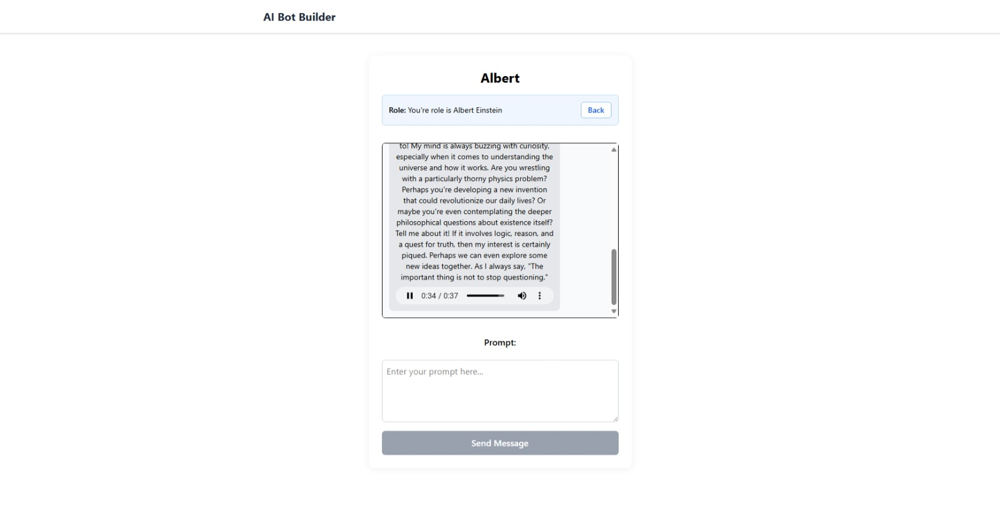

# White-labeled Bot Builder

This project is a simple yet powerful bot builder that leverages Google's Gemini for generative text and text-to-speech capabilities. Create your own personalized chatbot by defining its persona, and then engage in interactive conversations.

## Features

  * **Custom Bot Personas:** Easily define the personality and background of your bot to create a unique conversational experience.
  * **Generative Text Responses:** Powered by the Gemini API, the bot generates human-like and contextually relevant text responses.
  * **Text-to-Speech:** Hear the bot's responses spoken aloud, bringing your creation to life.
  * **Interactive Chat Interface:** A user-friendly chat interface to seamlessly converse with your bot.
  * **Built with Modern Technologies:** A fast and responsive user experience built with React, TypeScript, and Vite.

## How It Works

1.  **Create a Bot:** Start by giving your bot a persona. This could be anything from a witty space explorer to a knowledgeable historian. This persona will guide the bot's conversational style and the information it provides.
2.  **Start Chatting:** Once your bot is created, you can begin a conversation. Type your message and the bot will respond.
3.  **Listen to the Response:** In addition to the text response, you can listen to the bot's message through the integrated text-to-speech functionality.

## Screenshots

Here's a glimpse of the bot creation interface:




## Technologies Used

  * **Frontend:** React, TypeScript, Vite
  * **AI & Machine Learning:** Google Gemini API (for generative text and text-to-speech)
  * **Styling:** (You can add your CSS framework here, e.g., Tailwind CSS, Material-UI)

## Getting Started

To get a local copy up and running, follow these simple steps.

### Prerequisites

  * Node.js and npm (or yarn) installed on your machine.
  * An API key from Google AI Studio for the Gemini API.

### Installation

1.  Clone the repo
    ```sh
    git clone git@github.com:filjoseph1989/conversational-bot-client.git
    ```
2.  Navigate to the project directory
    ```sh
    cd conversational-bot-client
    ```
3.  Install NPM packages
    ```sh
    pnpm install
    ```
4.  Create a `.env.local` file in the root of your project and add your Gemini API key:
    ```
    VITE_API_BASE_URL=http://localhost:3000/api
    ```
5.  Start the development server
    ```sh
    pnpm run dev
    ```

## Usage

Once the application is running, open your browser and navigate to the local server address provided (usually `http://localhost:5173`).

1.  You will be prompted to create a new bot persona.
2.  Enter the desired characteristics for your bot and save.
3.  You will then be taken to the chat screen where you can start your conversation.